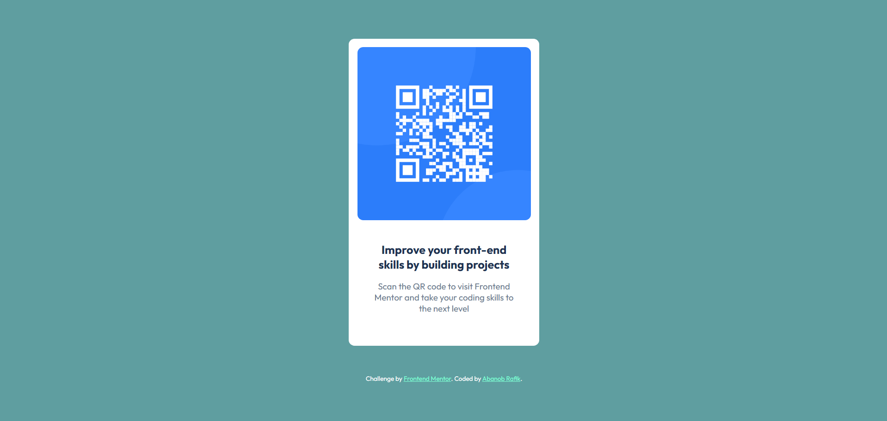

# Frontend Mentor - QR Code Component Challenge

## Overview

This is my solution to the first challenge on Frontend Mentor - the QR Code Component. The challenge is to build a QR code component that matches the provided design as closely as possible.

## Challenge

The task is to create a simple QR code component using HTML and CSS. The component should be centered on the page and should look similar to the design provided by Frontend Mentor.

## Screenshot

## Links

- Challenge URL: [Frontend Mentor - QR Code Component Challenge](https://www.frontendmentor.io/challenges/qr-code-component-iux_sIO_H)

## Built With

- Semantic HTML5 markup
- CSS custom properties
- Flexbox
